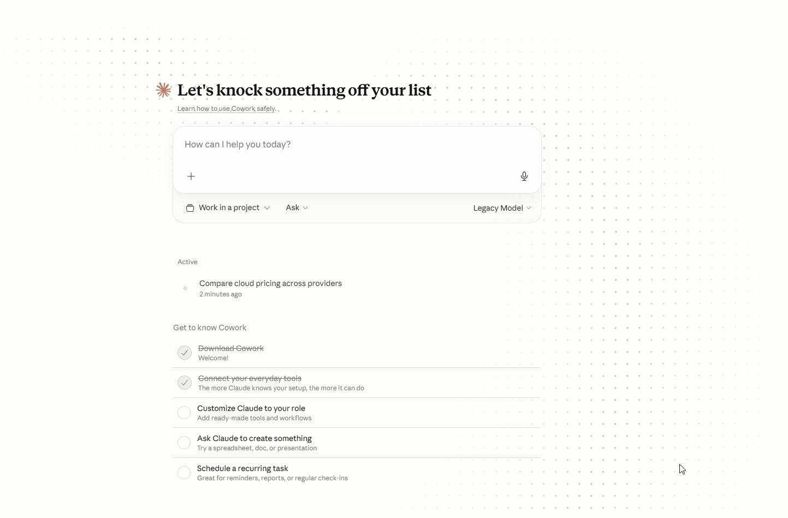

# cloudprice-mcp

<!-- mcp-name: io.github.alialbaker/cloudprice-mcp -->

[](https://pypi.org/project/cloudprice-mcp/)
[](https://pypi.org/project/cloudprice-mcp/)
[](LICENSE)
[](https://glama.ai/mcp/servers/alialbaker/cloudprice-mcp)

An MCP server that lets Claude (or any MCP-compatible client) compare on-demand **compute + block storage + object storage + managed Postgres** pricing across **AWS, Azure, GCP, and OCI** in real time. **9 tools.** OCI Always Free tier surfaced explicitly.



Ask things like:

> *"How much does a 4 vCPU / 16 GB Linux VM cost across AWS, Azure, and GCP in us-east?"*

> *"I have a 3-tier deployment: 8 web (4/16), 12 app (8/32), 4 DB (16/64), each with a 200 GB SSD OS disk, plus 5 TB SSD shared and 50 TB HDD bulk. Compare AWS vs Azure vs GCP monthly cost."*

> *"What does an EC2 `t3.xlarge` cost per month?"*

Claude calls the right tool, you get a clean answer with per-row + per-cloud + combined totals. No console-clicking. No tab-switching between three pricing calculators.

---

## Install

```bash
pip install cloudprice-mcp
```

Or run without installing:

```bash
pipx run cloudprice-mcp
```

Python 3.10+ required.

## Wire it into Claude Desktop

Edit your Claude Desktop config:

- **macOS:** `~/Library/Application Support/Claude/claude_desktop_config.json`
- **Windows:** `%APPDATA%\Claude\claude_desktop_config.json`

Add:

```json
{
  "mcpServers": {
    "cloudprice": {
      "command": "cloudprice-mcp"
    }
  }
}
```

Restart Claude Desktop. The nine tools below will show up as available.

## Tools exposed

### Single-spec lookups (v0.1)

| Tool | What it does |
|---|---|
| `get_aws_price` | Look up an EC2 instance type → vCPUs, memory, hourly + monthly USD (us-east-1) |
| `get_azure_price` | Look up an Azure VM size → vCPUs, memory, hourly + monthly USD (eastus) |
| `get_gcp_price` | Look up a GCP Compute Engine machine type → vCPUs, memory, hourly + monthly USD (us-east1) |
| `compare_clouds` | Given a target spec (vCPUs + GB), return the cheapest matching SKU across **AWS / Azure / GCP / OCI**, sorted by monthly cost, with savings summary |

### Bulk + workload compare (v0.2)

| Tool | What it does |
|---|---|
| `compare_compute_inventory` | Bulk-compare a list of compute workloads (each with vCPUs / memory / quantity / hours / optional OS disk) across all 4 clouds. Returns per-row matches, per-cloud totals, cheapest cloud. |
| `compare_storage_inventory` | Bulk-compare a list of block-storage volumes (each with capacity / disk type / quantity) across all 4 clouds. |
| `compare_workload` | Combined compute + block storage in one call. Mirrors a two-sheet sizing workbook (compute BoM + storage BoM). Optional `commitment` overlay applies 1-year (30%) or 3-year (50%) compute discount. |

### Object storage + managed Postgres (v0.3, NEW)

| Tool | What it does |
|---|---|
| `compare_object_storage` | Bulk-compare object-storage buckets across **AWS S3 / Azure Blob / GCP Cloud Storage / OCI Object Storage**. Each row specifies capacity_gb + tier (`hot` / `cool` / `archive`). **OCI Always Free 20 GB tier surfaced explicitly** — capacity ≤ 20 GB on OCI hot tier returns $0/mo. |
| `compare_postgres_database` | Bulk-compare managed PostgreSQL pricing across **AWS RDS / Azure Database for PostgreSQL / GCP Cloud SQL / OCI Database with PostgreSQL**. Each row specifies vCPUs / memory / storage_gb. Storage cost is calculated separately from compute. |

### Example: compare_workload input shape

```json
{
  "compute": [
    { "name": "web", "tier": "Web", "vcpus": 4, "memory_gb": 16, "quantity": 8,  "os_disk_gb": 100, "os_disk_type": "ssd" },
    { "name": "app", "tier": "App", "vcpus": 8, "memory_gb": 32, "quantity": 12, "os_disk_gb": 200, "os_disk_type": "ssd" },
    { "name": "db",  "tier": "DB",  "vcpus": 16, "memory_gb": 64, "quantity": 4, "os_disk_gb": 500, "os_disk_type": "ssd" }
  ],
  "storage": [
    { "name": "shared-fast", "tier": "DB",  "capacity_gb": 5000,  "disk_type": "ssd" },
    { "name": "shared-bulk", "tier": "App", "capacity_gb": 50000, "disk_type": "hdd" }
  ]
}
```

### Snapshots (v0.2.1)

`snapshot_count` on storage rows and `os_disk_snapshot_count` on compute rows **are now priced**. Snapshot rates per cloud per disk type are bundled (~$0.05/GB-mo for AWS/Azure, ~$0.026/GB-mo for GCP).

**Caveat — upper-bound estimate:** snapshots are priced as `snapshot_per_gb_month × full_capacity × quantity × snapshot_count`. Real-world snapshots are **incremental** (only changed blocks), so actual cost is typically 20-50% of this model's number. If snapshots dominate your total, ask the cloud's calculator for a tighter estimate.

`iops` and `throughput_mbs` on storage rows are still accepted as metadata only — not used for SKU matching in this release.

### Reserved Instance / Savings Plan estimator (v0.2.1)

`compare_workload` accepts an optional `commitment` parameter:

| Value | Compute discount | Use case |
|---|---|---|
| `none` (default) | 0% | On-demand only |
| `1yr_no_upfront` | 30% | 1-year AWS Savings Plan / Azure RI / GCP CUD (no upfront) |
| `3yr_partial_upfront` | 50% | 3-year, partial upfront — typical "we know our baseline" deals |

Storage and snapshots are not discounted (most clouds don't offer meaningful storage commitments). Discount tiers are conservative averages — your actual rate depends on instance family, payment option, and region.

## Pricing data

Prices are bundled as a curated dataset of common SKUs across **4 clouds**:
- **Compute** (~50 VM SKUs across AWS / Azure / GCP / OCI, including OCI A1 Always Free + A2 Arm Ampere + E5 Flex)
- **Block storage** (SSD + HDD per cloud)
- **Object storage** (Hot / Cool / Archive tiers per cloud, including OCI Always Free 20 GB)
- **Managed PostgreSQL** (RDS / Azure DB / Cloud SQL / OCI Database with PostgreSQL)

OCI pricing is verified against [Oracle's public pricing API](https://apexapps.oracle.com/pls/apex/cetools/api/v1/products/). Each response includes an `as_of` date so you know how fresh the data is.

### What's NOT modeled (real-world TCO killers)
- **Egress / data transfer** (often the actual hidden cost — especially for object storage)
- **Multi-AZ / HA replicas** (production usually doubles compute cost)
- **Reserved/Savings Plan SKU detail** (we apply a flat tier discount, not per-region/per-family detail)
- **IOPS-based storage matching** (capacity-only)
- **Backup storage charges** (some clouds free, others billed)
- **Request costs** (PUT/GET pricing for object storage)
- **Retrieval costs** for archive tiers (Glacier-style retrieval can be 10× the storage cost)

These are tracked roadmap items. **Use cloudprice-mcp for the on-demand list-price baseline; do final TCO analysis with each cloud's own calculator before relying on numbers for big decisions.**

**Live API mode is on the roadmap** (issue #1) — would fetch prices directly from each cloud's public pricing API:
- AWS: [Price List Bulk API](https://docs.aws.amazon.com/awsaccountbilling/latest/aboutv2/price-changes.html)
- Azure: [Retail Prices API](https://learn.microsoft.com/en-us/rest/api/cost-management/retail-prices/azure-retail-prices)
- GCP: [Cloud Billing Catalog API](https://cloud.google.com/billing/docs/reference/rest/v1/services.skus)

Track [issue #1](https://github.com/alialbaker/cloudprice-mcp/issues/1) for live mode and [issue #2](https://github.com/alialbaker/cloudprice-mcp/issues/2) for cross-cloud service mapping (RDS↔SQL DB↔Cloud SQL, etc.).

## Develop locally

```bash
git clone https://github.com/alialbaker/cloudprice-mcp.git
cd cloudprice-mcp
pip install -e ".[dev]"
pytest
```

To point Claude Desktop at your dev copy, swap the `command` in the config:

```json
{
  "mcpServers": {
    "cloudprice": {
      "command": "python",
      "args": ["-m", "cloudprice_mcp.server"]
    }
  }
}
```

## License

MIT — see [LICENSE](LICENSE).

## Credits

Built by [Ali Albaker](https://cloud.albaker.info), multi-cloud architect — runs a live three-cloud portfolio at ~$1.80/month across AWS, Azure, and GCP, with OCI joining as the 4th cloud in 2026.
